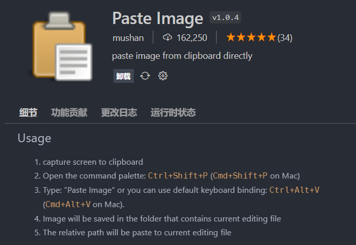

# OneNote 迁移 Markdown

编辑器有 vscode、typora 等可以选择，使用 vscode 需要装一些插件

zen mode: Ctrl + k z

## Markdown All in One

1. 提供快捷键和自动补全
2. 支持生成目录
3. 边书写边预览(Ctrl + Shift + V or Ctrl + K V)
4. 可轻松转换为 HTML 文件和 PDF 文件
5. 优化了 List editing 的编辑
6. 格式化 table (Alt + Shift + F) 及 Task list (use Alt + C to check/uncheck a list item)
7. 支持特殊数学符号渲染
   $$ \sin60 + \tan30 $$

- 常用快捷键

  | Key               | Command                                                      |
  | ----------------- | ------------------------------------------------------------ |
  | Ctrl + B          | 粗体                                                         |
  | Ctrl + I          | 斜体                                                         |
  | Alt + S           | 删除线                                                       |
  | Ctrl + Shift + ]  | 标题(up level)                                               |
  | Ctrl + Shift + [  | 标题(down level)                                             |
  | Ctrl + M          | 切换数学环境                                                 |
  | Alt + C           | 格式化任务列表                                               |
  | Alt + SHIFT + F   | 格式化表格                                                   |
  | 选择文字 Ctrl + v | 快速插入[链接](https://www.bilibili.com/video/BV1si4y1472o/) |

  [示例](https://segmentfault.com/a/1190000017461306)

- 常用命令，先按 F1 进入 VSCode 命令面板
  - 自动创建目录 Create Table of Contents
  - 更新目录 Update Table of Contents
  - 添加/更新标题编号 Add/Update Section numbers

## markdownlint

让你的 markdown 更加规范 -- Rules 规则提示信息

## Paste Image

把图片插入到 markdown，快捷键 Ctrl + Alt + V
{width="80%"}

## Markdown Preview Enhanced

支持预览，右键导出 pdf，公式不会错乱
