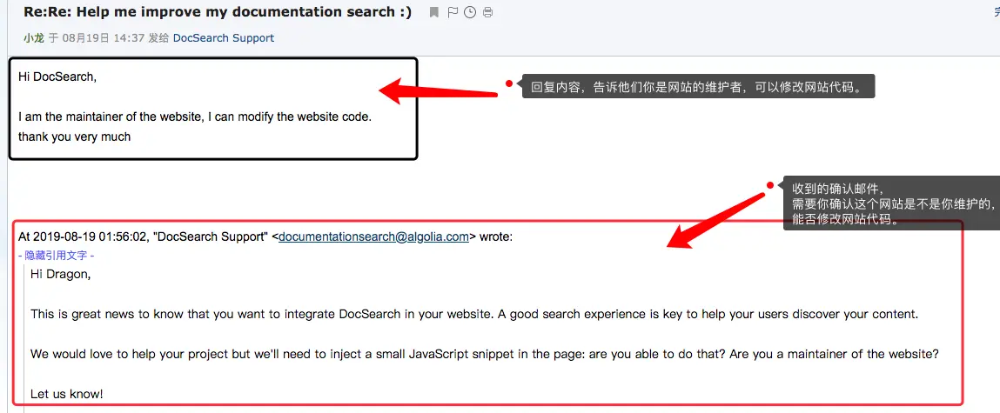

# VitePress 配置

## 设置搜索使用 Algolia 搜索

在 algolia 网站注册，然后自己上传网站数据非常麻烦。
algolia 提供了简化的方式 Algolia DocSearch，提交自己的网站，然后加入少量的脚本，就能使用了。

具体使用方法：

1. 打开 [Algolia DocSearch](https://docsearch.algolia.com/) 输入自己的文档地址和邮箱。
2. Algolia DocSearch 会发送确认邮件，收到后需要回复一下这个网站是你自己的，并且可以修改网站代码：
   
3. Algolia DocSearch 会发送一封使用邮件，里面有 apiKey 和 indexName
4. 在配置文件中添加如下内容, apiKey 和 indexName 就是上面邮件中的内容

> 参考[VuePress 搭建个人技术文档网站教程](https://segmentfault.com/a/1190000017055963)
