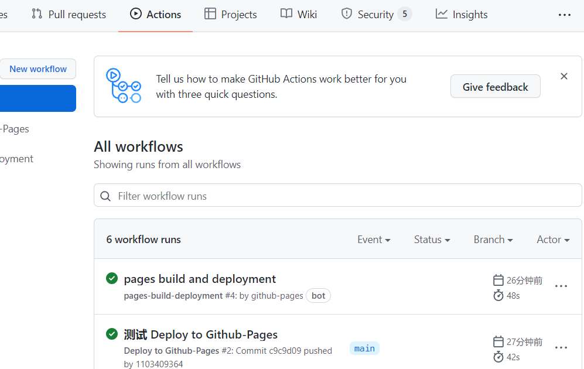

# VitePress 配置

## 站内搜索

Algolia DocSearch 申请被拒：

> 我们看了看你提供的链接，似乎你的网站是不符合随着 Doc Search 的政策.
> 我们只提供 Doc Search 技术项目的文档而且,除非我们错过了什么,似乎你的网站不符合这个标准。

VitePress 目前不支持搜索

## Vite 打包报错

可能是

- .md 文件的文件名使用了特殊符号，如 `+`
- 超链接里使用了 `import.meta.env.*`

## Github Pages 自动化部署

[GitHub-Pages 自动化部署 + github/gitee 选择](https://blog.csdn.net/qq_39823295/article/details/108913538)

使用 GitHub-Actions 实现文档更新后自动部署到 Github Pages：

**第一步** 新建目录和 Actions 配置文件 `.github\workflows\deploy.yml`

```yml
name: deploy to Github-Pages

on: [push] # 触发条件(git 推送时)

jobs:
  build-and-deploy:
    runs-on: ubuntu-latest
    steps:
      - name: Checkout 🛎️
        uses: actions/checkout@v2 # 下面这个最好设成 false
        with:
          persist-credentials: false

      - name: Install and Build 🔧
        run: |
          npm install
          npm run build
        env:
          CI: false

      - name: Deploy 🚀
        uses: JamesIves/github-pages-deploy-action@v4.2.3
        with:
          BRANCH: gh-pages # 部署的目标分支
          FOLDER: docs/.vitepress/dist # 部署的静态资源文件，打包后的文件的路径
```

**第二步** 配置 Pages，进入 Github-Settings-Pages，配置 Github Pages 的 Source 分支和路径  
**第三步** 在 main 分支提交代码测试。git 提交 push 后，在 Github-Actions 中可以看到 git 工作流执行的情况。



发现 Actions 有个的 pages-build-deployment 哪来的？

[JamesIves/github-pages-deploy-action](https://github.com/JamesIves/github-pages-deploy-action) 创建的
